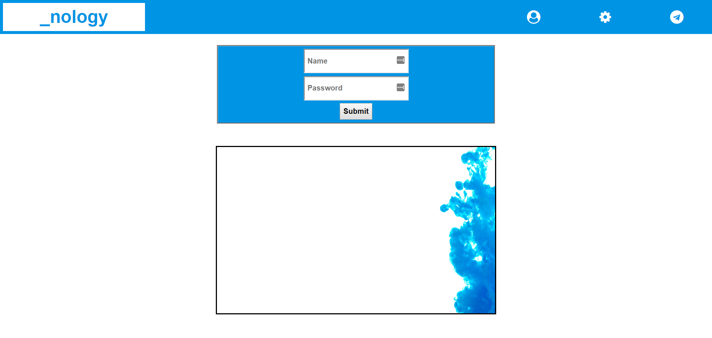

# Challenges

1. Replicate the screenshots below using font awesome icons for the navbar links
2. Install the ChromeVox screenreader
3. Edit your HTML to improve the accessibility. The screenreader should pick up & describe:

- The nology tag in the header/navbar
- The user, settings & messenger links
- The image (nology background image)

