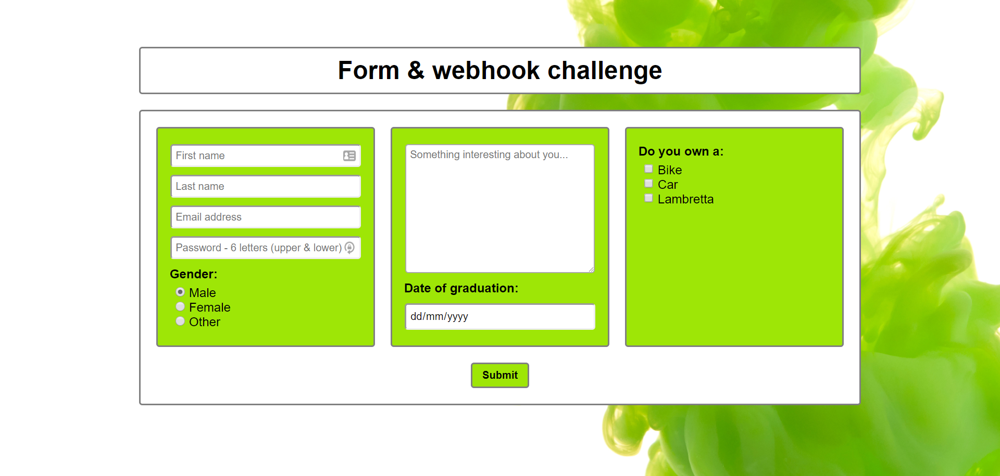
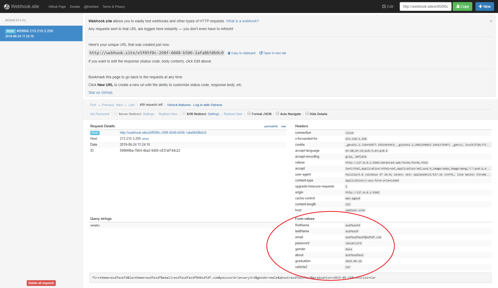
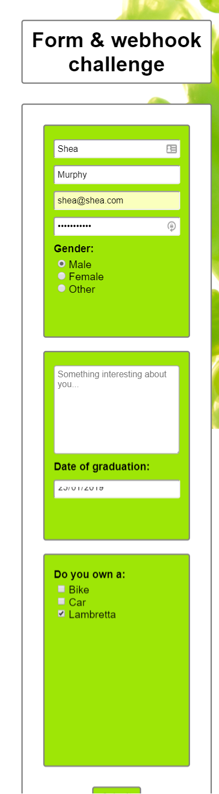

# Challenges

1. Create a form with the input fields displayed below
3. Go to webhook.site to get a unique url to submit the data to
4. On submission of the form send the encrypted data to your unique URL
5. When you revisit webhook.site you should be able to see the submitted data (see second screenshot)

- -Inputs in the left-most fieldset should be required
- -Password should be at least 6 letters and contain both Upper/lower letters

## Extension Challenge

1. Add responsiveness to your form page so that the fieldsets resize

