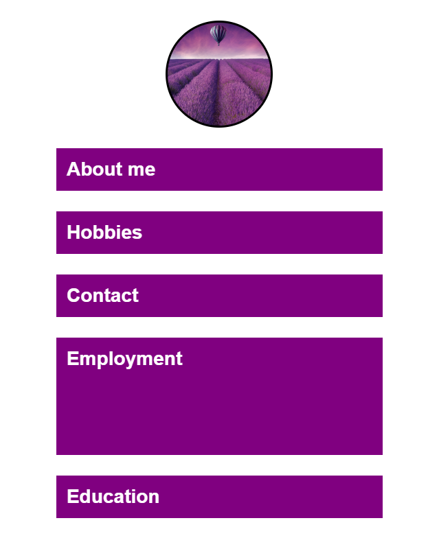
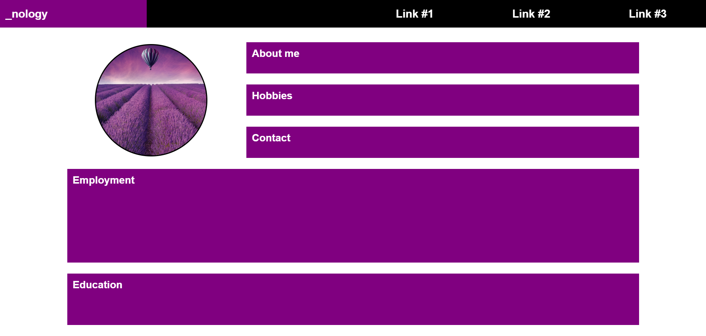
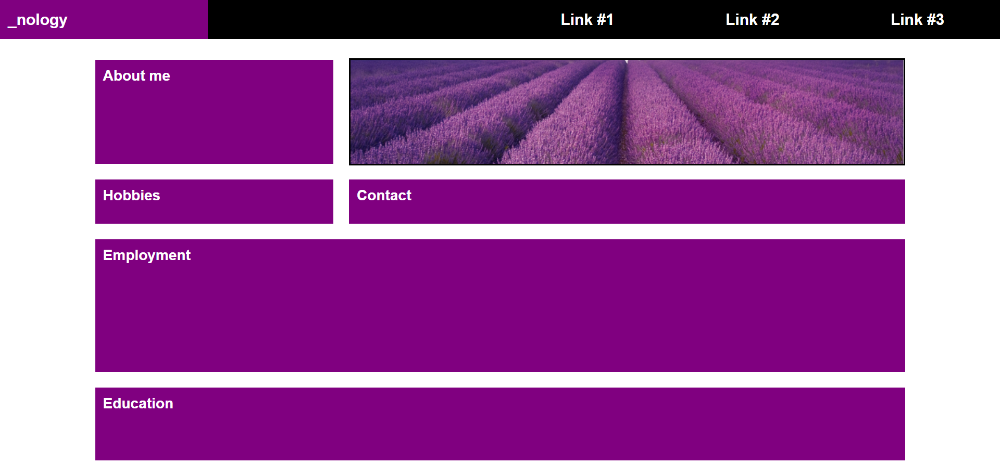

# Challenges

1. Replicate the screenshots below using CSS grid layout to create the layout for mobile and desktop views.
2. The first screenshot shows the mobile view (below 550px) and the second shows the web page on everything wider than a mobile (above 550px).

## Extension Challenge

1. Add a second breakpoint at 768px and create the following layout to display on tablet (between 550 & 768px) using CSS grid.

