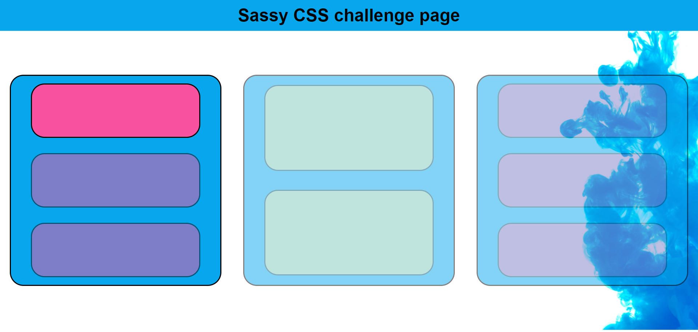
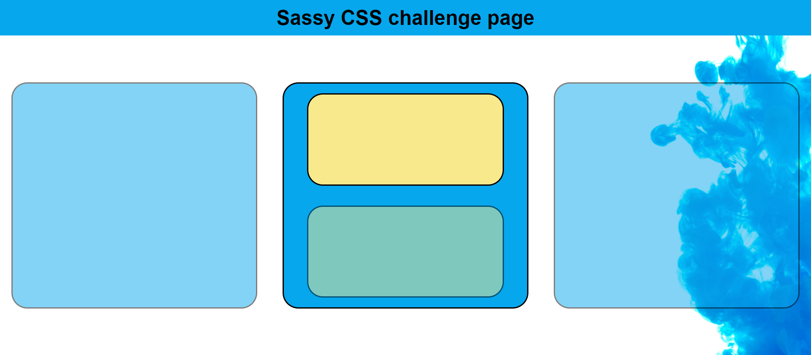

# Challenges

## !!Open the solution/index.html file in the live-server to see the desired behaviour!! ##

1. Emulate the following screenshot using SCSS as a pre-processor:
2. The three panels and their individual contents should be transparent by default
3. On hover they should lose their transparency (e.g. top left pink panel in screenshot)
4. Open the solution files live server to see the desired behaviour for clarification
5. The following values should be set as variables at the beginning of the scss file: border, border-radius, any theme colours, any spacings

## Extension Challenge

1. Emulate the following screen shot:
2. Use utility classes to hide the contents of the panels by default
3. As you hover over a panel its contents should become visible (but remain transparent until you hover over them directly) e.g. the top box in the middle panel is currently hovered over
4. Open the solution files live server to see the desired behaviour for clarification
5. Use inheritance or mixins to replace any repetition in your CSS (e.g. flex settings or utility classes)
6. Use a mixin to change opacity by passing an opacity value into the mixin

