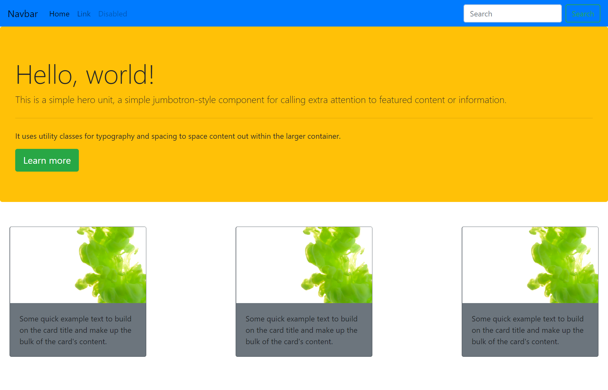
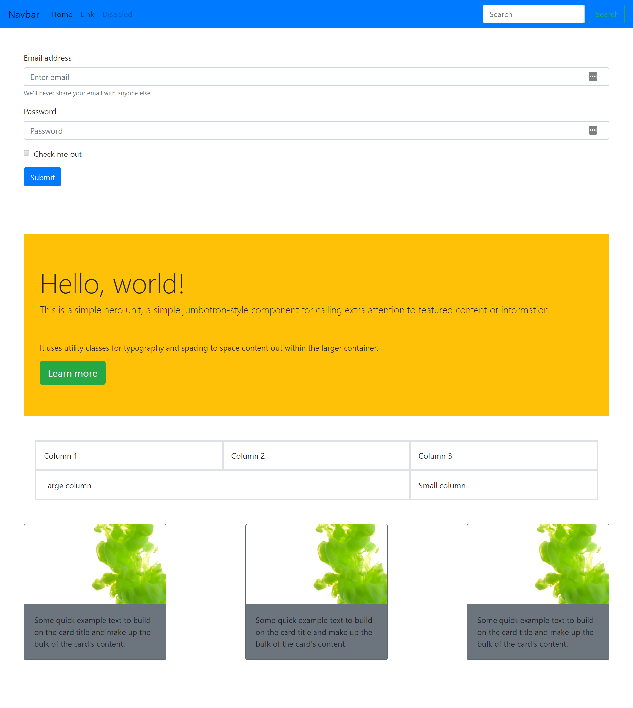

# Challenges

1. Replicate the screenshots below by implementing bootstrap and using their navbar, jumbotron and card components

## Additional Challenge

1. Replicate the second screenshot by bringing in a boostrap form
2. Implement bootstrap padding and margin to get uniform spacing on all elements within the body.

