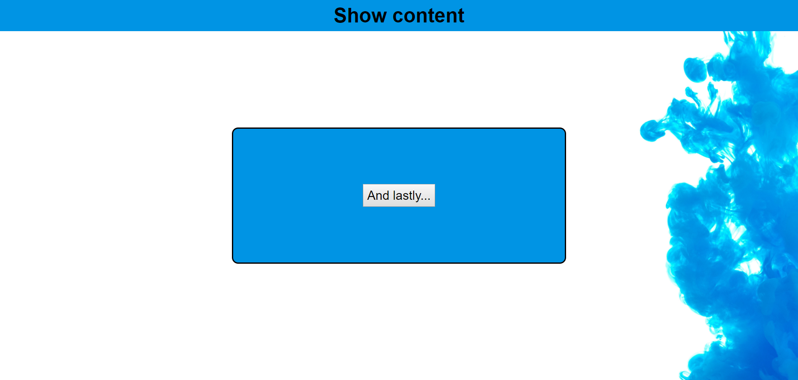

# Challenges

1. Replicate the screenshot below using JQuery functions to imitate the desired behaviours

## Additional Challenge

1. Add in the buttons and desired behaviours for the final panel of the screenshot below
2. Open up the extension file in the live-server and note down all the changes that occur when you click a button
3. Search for the jquery functions that match these actions

