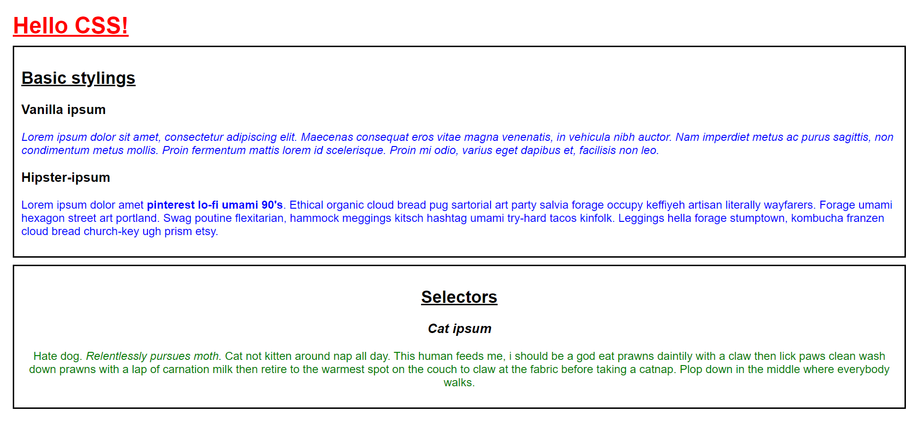
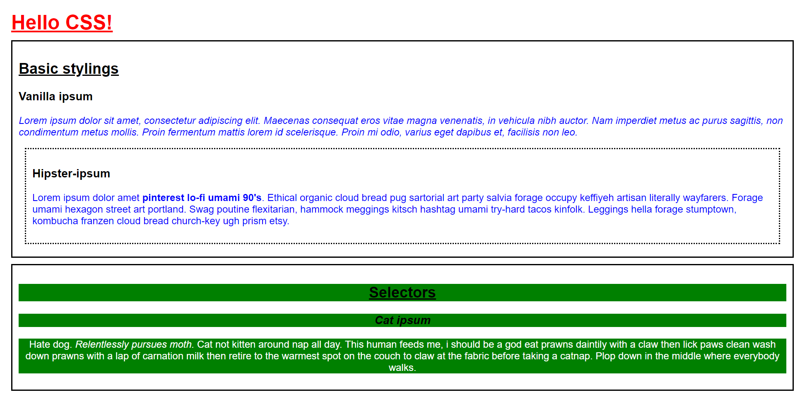

# Challenges

Emulate the following screen shot using:
- Seperate HTML and CSS files
- Use of tag, class and id selectors where appropriate 

## Text

**Vanilla ipsum**: "Lorem ipsum dolor sit amet, consectetur adipiscing elit. Maecenas consequat eros vitae magna venenatis, in vehicula nibh auctor. Nam imperdiet metus ac purus sagittis, non condimentum metus mollis. Proin fermentum mattis lorem id scelerisque. Proin mi odio, varius eget dapibus et, facilisis non leo."

**Hipster ipsum**: "Lorem ipsum dolor amet pinterest lo-fi umami 90's. Ethical organic cloud bread pug sartorial art party salvia forage occupy keffiyeh artisan literally wayfarers. Forage umami hexagon street art portland. Swag poutine flexitarian, hammock meggings kitsch hashtag umami try-hard tacos kinfolk. Leggings hella forage stumptown, kombucha franzen cloud bread church-key ugh prism etsy."

**Cat ipsum**: "Hate dog. Relentlessly pursues moth. Cat not kitten around nap all day. This human feeds me, i should be a god eat prawns daintily with a claw then lick paws clean wash down prawns with a lap of carnation milk then retire to the warmest spot on the couch to claw at the fabric before taking a catnap. Plop down in the middle where everybody walks."

## Extension Challenge

Emulate the following screen shot using extra selectors and styles where approriate, as an extra challenge use a custom font

